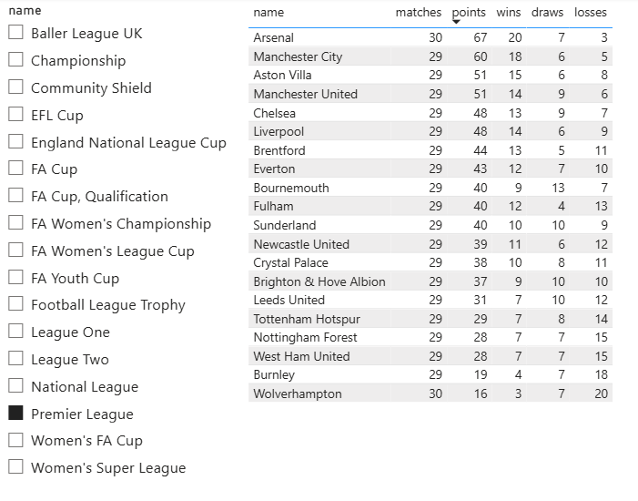
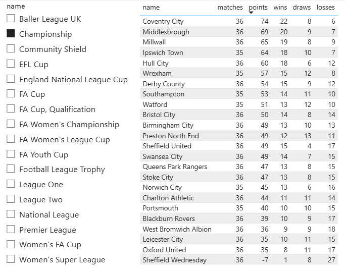

# English Football Analytics - Serverless ETL Pipeline


## Overview
This project is an automated, serverless ETL (Extract, Transform, Load) pipeline that extracts real-time football data from the top 4 English leagues (Premier League, Championship, League One, and League Two). It processes standings, team metrics, and player statistics, storing the clean data in a Cloud Data Warehouse for business intelligence visualization.

## Architecture & Technologies

* **Data Source:** SofaScore API (via RapidAPI REST endpoints).
* **Extraction & Transformation:** Python (`requests`, `pandas`).
* **Compute / Orchestration:** Google Cloud Run Functions (Serverless) triggered by Google Cloud Scheduler (Cron jobs).
* **Data Warehouse:** Google BigQuery.
* **Data Visualization:** Power BI (Relational Data Modeling).

## Pipeline Workflow

1. **Trigger:** Cloud Scheduler initiates the pipelines every Monday morning.
2. **Extract:** Two independent Cloud Functions fetch JSON data from the API:
   * `teams_etl`: Extracts current standings and team metrics for all 4 divisions.
   * `players_etl`: Extracts detailed player statistics (goals, assists, tackles, ratings) using offset pagination.
3. **Transform:** Python and Pandas parse the nested JSON, clean the fields, handle missing values, and structure the data into flat dataframes.
4. **Load:** The transformed data is loaded via `google-cloud-bigquery` directly into dimensional and fact tables in BigQuery (`WRITE_TRUNCATE` mode to maintain fresh data).
5. **Visualize:** Power BI connects to BigQuery in Import Mode, utilizing a cascading relational model (Tournaments -> Teams -> Players) to filter insights dynamically.

## Repository Structure

```text
football-data-pipeline/
│
├── teams_etl/
│   ├── main.py              # Cloud Function code for team standings
│   └── requirements.txt     # Python dependencies
│
├── players_etl/
│   ├── main.py              # Cloud Function code for player statistics
│   └── requirements.txt     # Python dependencies
│
├── .gitignore               # Ignored files (credentials, virtual envs, local caches)
└── README.md                # Project documentation

- Power BI Dashboard

<h3 align="center">Dynamic Tournaments Filtering</h3>
<p align="center">


</p>
<p align="center">
<i>This dashboard utilizes dimensional modeling to dynamically filter league standings, team statistics, and player metrics across the top 4 English divisions. The cascade relational structure ensures instant data cross-filtering upon selecting a tournament.</i>
</p>

- How to Run Locally
Clone the repository.

Create a virtual environment and install dependencies: pip install -r teams_etl/requirements.txt

Set up your Google Cloud Service Account and generate a gcp_credentials.json key.

Set your environment variables for API_KEY and PROJECT_ID.

Run the main.py files locally to test the extraction and BigQuery load.